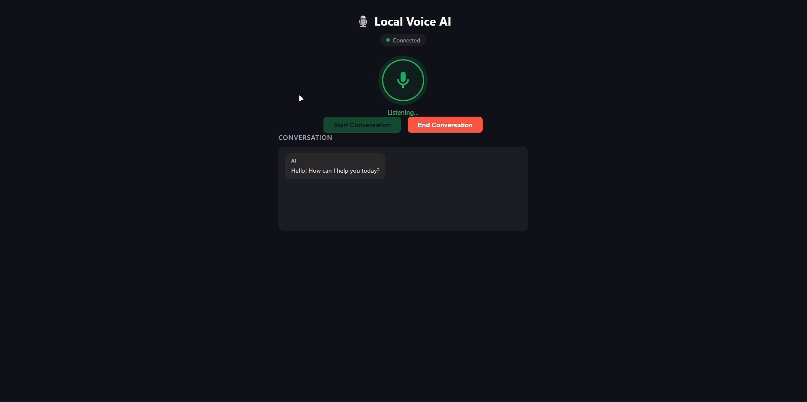

<div align="center">

# 🎙️ LocalVoiceAI

**ElevenLabs handles the voice. Your own local LLM handles the brain.**

A self-hosted, OpenAI-compatible Custom LLM backend that plugs into ElevenLabs Conversational AI — so the speech-to-text, turn-taking, and text-to-speech stay on ElevenLabs' infra while the actual thinking happens on your own machine, for free, via Ollama.

[](https://www.python.org/)
[](https://fastapi.tiangolo.com/)
[-000000?logo=ollama&logoColor=white)](https://ollama.com/)
[](https://elevenlabs.io/)
[](https://streamlit.io/)

[Overview](#-overview) • [Demo](#-demo) • [Architecture](#-architecture) • [Tech Stack](#-tech-stack) • [Setup](#-setup) • [API](#-api-reference) • [Roadmap](#-roadmap)

</div>

---

## 🧠 Overview

LocalVoiceAI is an MVP that lets you swap ElevenLabs' default LLM for a model running entirely on your own hardware, with **zero cloud inference cost**.

ElevenLabs' Conversational AI agent still does all the voice work — speech recognition, turn-taking, and speech synthesis. But instead of sending the conversation to OpenAI/Anthropic/Gemini, it calls **your** FastAPI server, which speaks the OpenAI Chat Completions protocol and forwards everything to a local **Ollama** model (`llama3.1:latest` by default).

The provider layer is abstracted behind a common interface, so swapping Ollama for a hosted provider later is a config change, not a rewrite.

**What's in the box:**
- 🔌 An OpenAI-compatible `/v1/chat/completions` endpoint (streaming + non-streaming) that ElevenLabs' Custom LLM integration can call directly
- 🌐 A built-in browser widget (mic button + live transcript) that talks to the ElevenLabs Conversational AI SDK directly, using a signed URL/agent ID your backend issues
- 🧪 A Streamlit debug console to chat with the backend without touching ElevenLabs at all
- 🔐 Optional bearer-token auth on the completions endpoint

## 📸 Demo

<div align="center">



*The built-in browser widget: mic status, connection state, and a live transcript of the conversation with the local model.*

</div>

A short screen recording is also available at [`demo/demo.mp4`](demo/demo.mp4).

## 🏗️ Architecture

**Voice path** (this is the one ElevenLabs actually drives):

```text
User speaks (browser mic)
  → ElevenLabs Conversational AI Agent (STT + turn-taking)
  → FastAPI  /v1/chat/completions  (Custom LLM, OpenAI-compatible)
  → LLM provider abstraction
  → Ollama (llama3.1:latest)
  → FastAPI streams back OpenAI-style SSE chunks
  → ElevenLabs turns the text into speech (TTS)
```

**Debug path** (Streamlit — text only, no voice):

```text
Streamlit UI  →  FastAPI API  →  LLM Provider  →  Ollama
```

The `/api/conversation/signed-url` endpoint is what the browser widget calls before opening a WebSocket to ElevenLabs — it returns a signed URL when an `ELEVENLABS_API_KEY` is configured, or falls back to a bare `agent_id` for a public/allowlisted agent.

## 🧰 Tech Stack

| Layer | Technology | Purpose |
|---|---|---|
| Voice orchestration | ElevenLabs Conversational AI | STT, turn-taking, TTS, WebSocket transport |
| Backend API | FastAPI + Uvicorn | OpenAI-compatible Custom LLM endpoint |
| HTTP client | httpx (async) | Talks to Ollama and the ElevenLabs REST API |
| Local inference | Ollama (`llama3.1:latest`) | Runs the actual model, pluggable via provider interface |
| Config | Pydantic + python-dotenv | Typed settings loaded from `.env` |
| Browser widget | Vanilla JS + `@elevenlabs/client` | Mic button, live transcript, no build step |
| Debug console | Streamlit | Text-only chat against the backend for testing |

## 📁 Project Structure

```text
LocalVoiceAI/
├── app/
│   ├── main.py            # FastAPI app: routes, SSE streaming, signed-url proxy
│   ├── config.py          # Pydantic Settings loaded from .env
│   ├── schemas.py         # OpenAI-compatible request/response models
│   └── llm/
│       ├── base.py            # LLMProvider interface + error types
│       └── ollama_provider.py  # Ollama implementation (chat, stream, health check)
├── frontend/
│   ├── index.html          # Mic button + transcript widget
│   ├── app.js               # Wires up @elevenlabs/client, drives the UI
│   └── styles.css
├── ui/
│   └── streamlit_app.py    # Text-only debug console
├── demo/
│   ├── screenshot.png      # Browser widget screenshot
│   └── demo.mp4            # Screen recording of a live conversation
├── requirements.txt
└── README.md
```

## ⚙️ Setup

### 1. Clone and install

```bash
git clone https://github.com/ahmedayman2825/LocalVoiceAI.git
cd LocalVoiceAI
python -m venv .venv
source .venv/bin/activate      # Windows: .venv\Scripts\Activate.ps1
pip install -r requirements.txt
```

### 2. Configure environment

Create a `.env` file in the project root:

```env
LLM_PROVIDER=ollama
OLLAMA_BASE_URL=http://localhost:11434
OLLAMA_MODEL=llama3.1:latest
HOST=0.0.0.0
PORT=8000
BACKEND_URL=http://localhost:8000
CUSTOM_LLM_API_KEY=
ELEVENLABS_API_KEY=
ELEVENLABS_AGENT_ID=
```

`CUSTOM_LLM_API_KEY` is optional — leave it blank to disable auth on `/v1/chat/completions`. `ELEVENLABS_AGENT_ID` is required for the browser voice widget; `ELEVENLABS_API_KEY` is only needed if your agent requires a signed URL rather than a public/allowlisted `agent_id`.

### 3. Pull the model and run Ollama

```bash
ollama pull llama3.1:latest
ollama serve
```

### 4. Start the backend

```bash
uvicorn app.main:app --host 0.0.0.0 --port 8000
```

```bash
curl http://localhost:8000/health
```

```json
{ "status": "ok", "provider": "ollama", "model": "llama3.1:latest" }
```

### 5. Try it

- **Browser widget:** open `http://localhost:8000/` for the mic + transcript UI
- **Streamlit debug console:**

  ```bash
  streamlit run ui/streamlit_app.py
  ```

  then open `http://localhost:8501`

### 6. Wire it into ElevenLabs

Expose the backend publicly (e.g. with ngrok) and point your ElevenLabs agent's Custom LLM config at it:

```bash
ngrok http 8000
```

```text
API type:        Chat Completions
Base URL:        https://YOUR-NGROK-URL.ngrok-free.app/v1
Model ID:        local-llama
Endpoint called: /v1/chat/completions
```

If `CUSTOM_LLM_API_KEY` is set, add the same value as the bearer token in ElevenLabs' configuration.

## 📡 API Reference

| Endpoint | Method | Description |
|---|---|---|
| `/health` | GET | Backend status, provider name, and live Ollama reachability/model-availability check |
| `/v1/models` | GET | Lists the OpenAI-style model ids the backend answers to |
| `/v1/chat/completions` | POST | OpenAI-compatible chat completions — supports `stream: true/false` |
| `/api/conversation/signed-url` | GET | Returns a signed WebSocket URL (or bare `agent_id`) for the browser widget |

`/v1/chat/completions` accepts and safely ignores extra OpenAI-style fields (`tools`, `tool_choice`, `user_id`, `elevenlabs_extra_body`) so it doesn't break when ElevenLabs sends more than a minimal payload expects.

Streaming responses use `Content-Type: text/event-stream`, emit `data: {json}\n\n` chunks, and terminate with `data: [DONE]`.

## 🗺️ Roadmap

- [x] OpenAI-compatible streaming + non-streaming completions
- [x] Ollama provider with health checks and model-availability detection
- [x] Browser mic widget wired to ElevenLabs Conversational AI
- [x] Streamlit debug console
- [ ] Additional providers (OpenAI, Anthropic, Gemini) behind the existing `LLMProvider` interface
- [ ] Conversation memory / persistence across sessions
- [ ] Dockerfile + docker-compose for one-command startup
- [ ] Automated tests for the SSE streaming path

## ⚠️ Notes

- No OpenAI SDK, OpenAI API key, or ElevenLabs API key is required for the backend itself to run — ElevenLabs only needs your public endpoint URL.
- `GET /health` never requires authentication, even when `CUSTOM_LLM_API_KEY` is set.
- Ollama must be running locally (or reachable at `OLLAMA_BASE_URL`) for any completion to succeed.

---

<div align="center">

Built by **Ahmed Ayman**

[](https://www.linkedin.com/in/eng-ahmed-ayman/)
[](https://github.com/ahmedayman2825)

</div>
